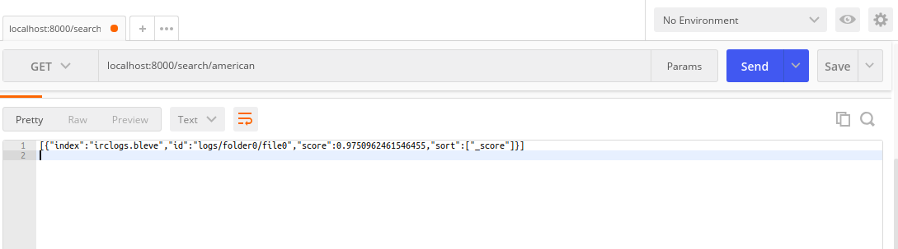

## File Indexer

This is a simple project which reads files in the directory mentioned in the config file and indexes it. This then can be used to search the files present in the directory.


#### Motivation

This is a way of trying to index the logs file in dgplug so that we can easily find the files in which a word has occured in the file.


#### Dependency

This assumes that you have `Go` installed and setup.

All dependecies are added in `dep` and we need to make sure we install `fresh` although it is already added to the lock.


#### Development

This is a service and it doesn't have any `UI` so in order to use this project or hack on the project we need a way to communicate with it. We can use the good old `curl` but let's be a little adventurous and use [POSTMAN](https://www.getpostman.com/) for the same.

Make sure to carry on the following steps:

```bash

make clean # for cleaning up
make dev # for development purposes
make logs # for getting the dummy directory ready

```

Once you did this you will notice that there is a `logs` directory created with different folder and each folder will have different files. Remember all these files are dummy files and they have some random junk.

Then run `make build` this should start the server. Once everything is working fine install the postman plugin for your browser. And from that plugin you need to hit the endpoint as:

`localhost:8000/search/american`

Here `american` is the query word that I passed, make sure to open any file in the `logs/` directory and find a word to search. It will look like this:




This also has the response `file-indexer` sends back.